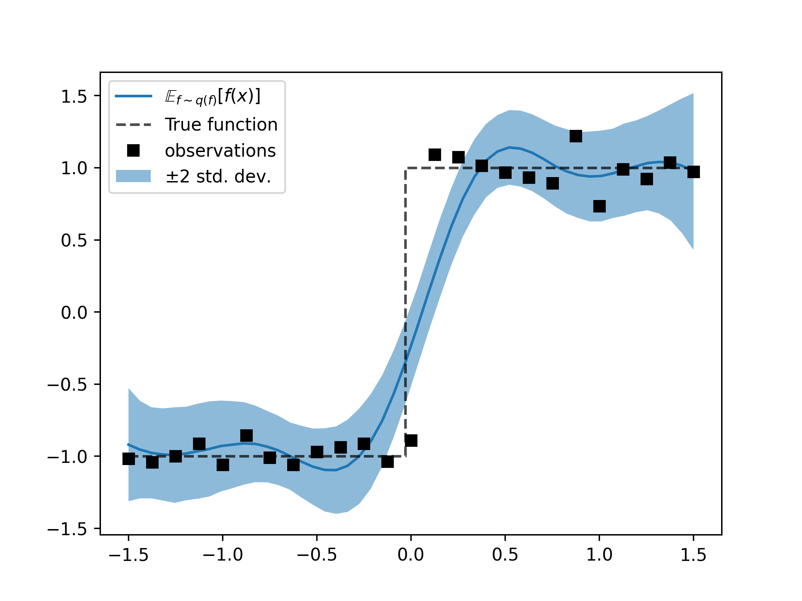

## Gaussian processes training example

Demonstrates using distribution type objects inside NN-Layers

For a simple example of GP regression
inside of a `flax.nn.Model` run

```shell script
> python basic_gp.py
```

For an example of fitting a variational Gaussian
process run, and to plot the resulting fit

```shell script
> python basic_svgp.py --plot=True
```

Finally to fit a Deep-GP to a step function, using 
different numbers of layers run

```shell script
> python basic_dgp.py --plot=True --num_layers=2
```

SVGP      | 2-Layer DeepGP
:--------:|:----------------:
 |  [](./imgs/2layer_deepgp.png)